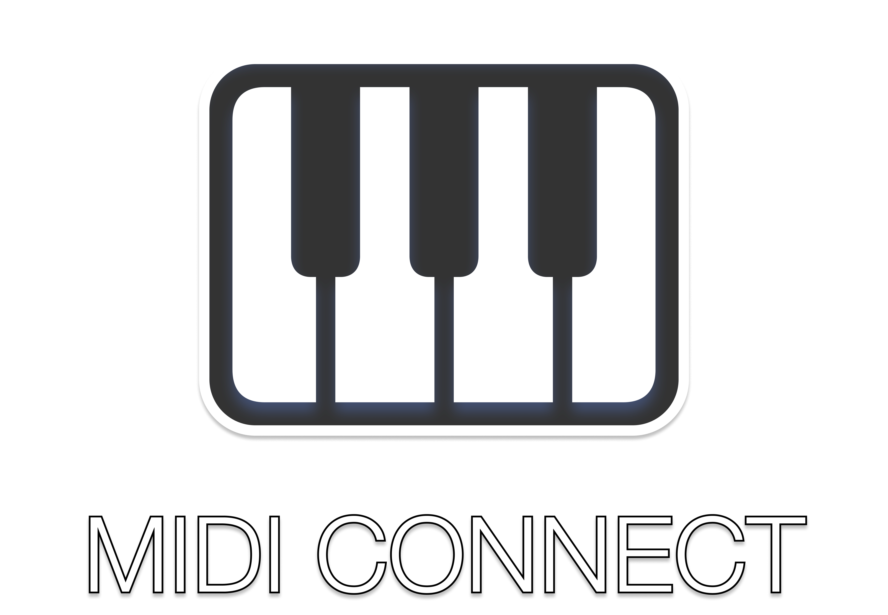

# MIDI Connect for Windows - EXPERIMENTAL STATUS

Let's finally make it simple to connect Bluetooth MIDI devices on Windows.



MIDI Connect lives in you Windows taskbar tray. Select the device which you want to connect to and, immediately start using it in your favourite creative software.

## Dev
MIDI Connect is build in the `.NET` framework. To build and run,
```dotnet
dotnet build
```
and
```dotnet
dotnet run
```

MIDI Connect is in an early experimental phase and expect there to be problems. Community improvements are very welcome, here are the most important missing peaces:
- more device information. Implement the Bluetooth BAS and DIS services.
- proper separation of concern between the modules. Proper lifecycle handling.
- rememeber devices through a device store.
- auto-connect

Coding agents are welcome to contribute, but be cautious. We won't accept messy code. It is recommended to use `opencode`. `Kimi K2` is the recommended model because it balances cost, speed and quality very well.